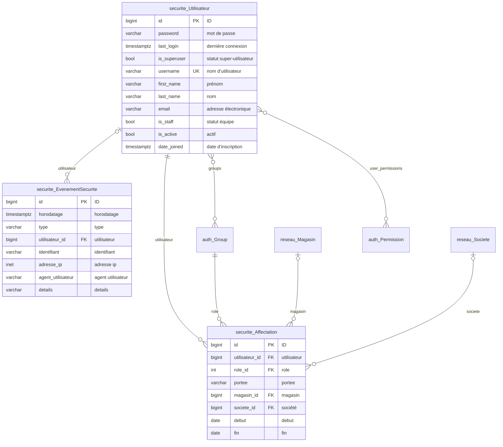
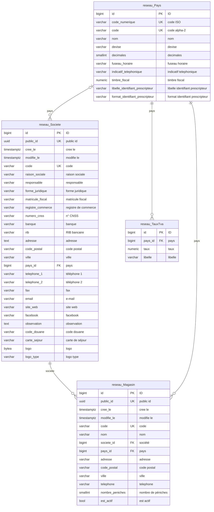
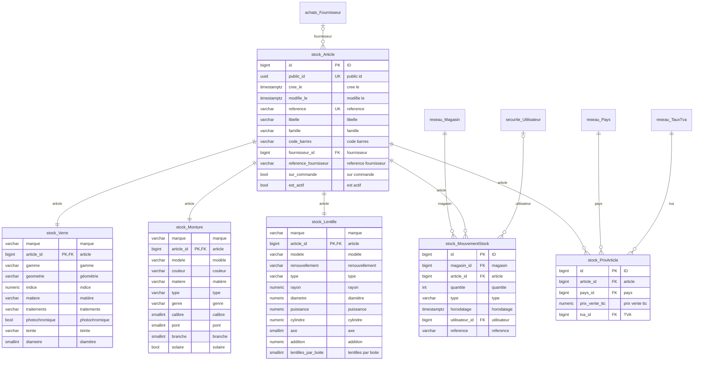
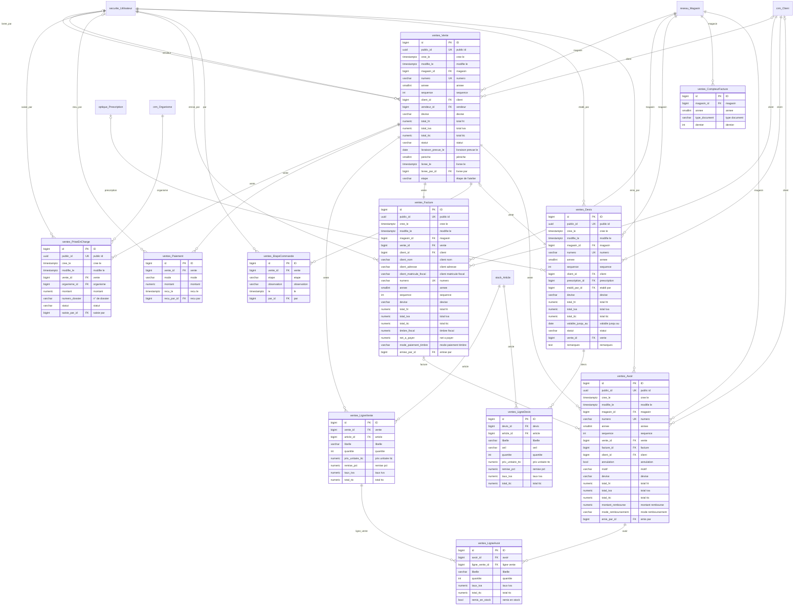
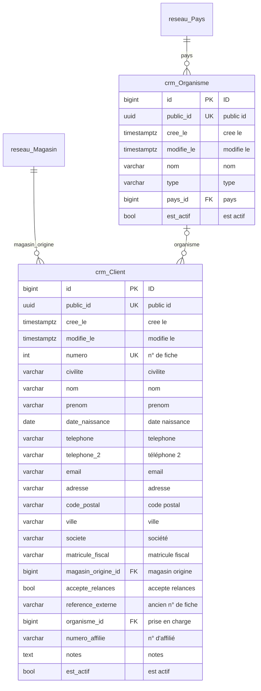
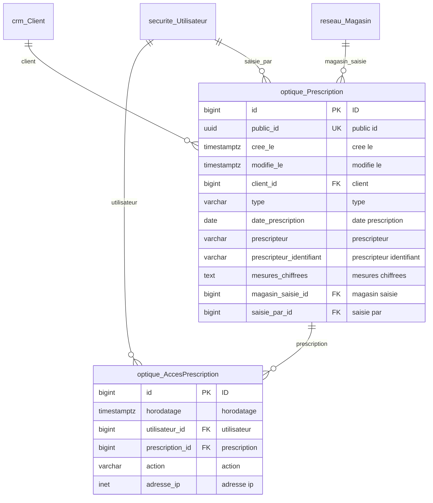
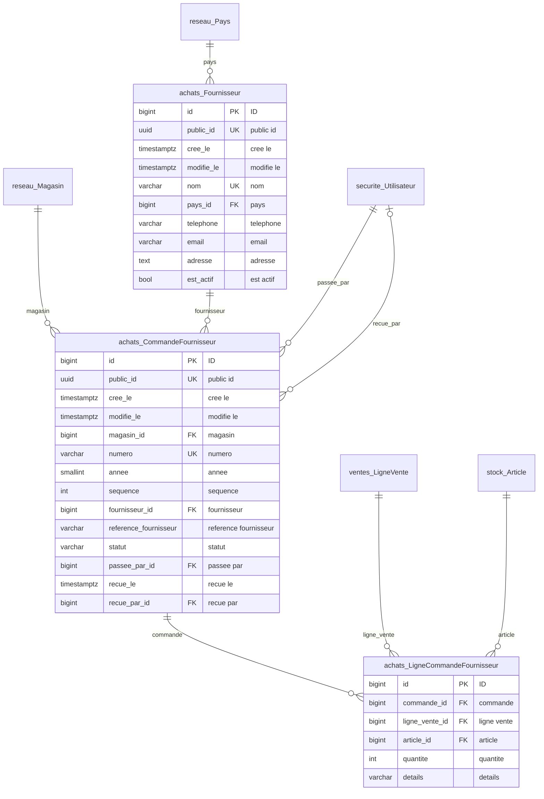
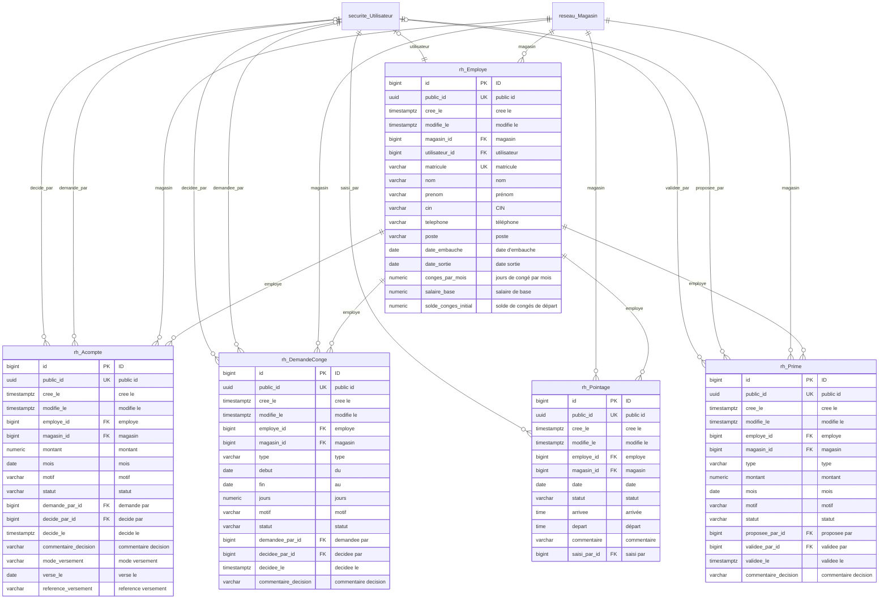
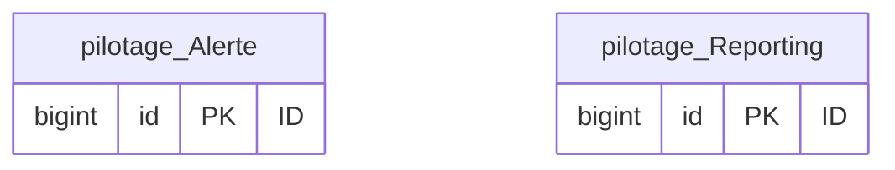

# Schéma de la base de données

<!-- Fichier généré par `python manage.py schema_bd` : ne pas modifier à la main. -->

Base PostgreSQL d'OptiLink, une section par module. Chaque table a en général
`public_id` (identifiant exposé par l'API), `cree_le` et `modifie_le`. Une table
d'un autre module apparaît dans un diagramme par ses seuls liens, sans ses colonnes.

Les modifications de données (qui, quand, avant et après) sont conservées dans
`auditlog_logentry` ; l'historique des versions du logiciel est dans `CHANGELOG.md`.

## Sommaire

- [Sécurité](#securite) (3 tables)
- [Réseau de magasins](#reseau) (4 tables)
- [Stock](#stock) (6 tables)
- [Ventes](#ventes) (11 tables)
- [Clients](#crm) (2 tables)
- [Dossiers optiques](#optique) (2 tables)
- [Achats](#achats) (3 tables)
- [Trésorerie](#tresorerie) (4 tables)
- [Ressources humaines](#rh) (5 tables)
- [Alertes et reporting](#pilotage) (2 tables)

## Sécurité

| Table | Contenu | Colonnes |
| --- | --- | --- |
| `securite_affectation` | Affectation : Un rôle donné à un utilisateur sur un périmètre, pour une période. | 8 |
| `securite_evenementsecurite` | Événement de sécurité : Journal des connexions et opérations MFA, en ajout seul. | 8 |
| `securite_utilisateur` | Utilisateur : Compte OptiLink. Les droits viennent des affectations (rôle + périmètre). | 11 |

## Réseau de magasins

| Table | Contenu | Colonnes |
| --- | --- | --- |
| `reseau_magasin` | Magasin | 14 |
| `reseau_pays` | Pays : Paramètres propres à un pays : monnaie, fiscalité, formats. | 11 |
| `reseau_societe` | Société : Société qui exploite un ou plusieurs magasins : identité légale, coordonnées, logo. | 28 |
| `reseau_tauxtva` | Taux de tva | 4 |

## Stock

| Table | Contenu | Colonnes |
| --- | --- | --- |
| `stock_article` | Article : Article du catalogue, commun à tout le réseau ; son prix dépend du pays (``PrixArticle``). | 12 |
| `stock_lentille` | Caractéristiques de la lentille | 12 |
| `stock_monture` | Caractéristiques de la monture | 11 |
| `stock_mouvementstock` | Mouvement de stock : Entrée ou sortie d'un article dans un magasin. Le stock est la somme des mouvements. | 8 |
| `stock_prixarticle` | Prix de vente : Prix de vente d'un article dans un pays, dans la monnaie de ce pays, et son taux de TVA. | 5 |
| `stock_verre` | Caractéristiques du verre | 10 |

## Ventes

| Table | Contenu | Colonnes |
| --- | --- | --- |
| `ventes_avoir` | Avoir : Avoir : crédit rendu au client sur une vente (retour d'articles, ou annulation). | 20 |
| `ventes_compteurfacture` | Compteur de factures : Dernier numéro attribué par magasin, année et type de document (numérotation sans trou). | 5 |
| `ventes_devis` | Devis : Devis d'équipement remis à un client, avec ses prix figés jusqu'à la date de validité. | 19 |
| `ventes_etapecommande` | Étape de commande : Passage d'une commande à une étape du suivi qualité, avec qui et quand (traçabilité). | 6 |
| `ventes_facture` | Facture : Facture émise à part, au nom d'un client, pour une vente entièrement payée. | 21 |
| `ventes_ligneavoir` | Ligne d'avoir | 8 |
| `ventes_lignedevis` | Ligne de devis | 10 |
| `ventes_lignevente` | Ligne de vente | 9 |
| `ventes_paiement` | Paiement : Règlement reçu : tout le prix en caisse, ou acompte puis solde pour une commande. | 6 |
| `ventes_priseencharge` | Prise en charge : Part d'une vente payée par un organisme (CNAM, assurance, mutuelle) et non par le client. | 10 |
| `ventes_vente` | Vente : Vente enregistrée en caisse, avec son ticket. Jamais modifiée : une correction passera par un avoir. | 20 |

## Clients

| Table | Contenu | Colonnes |
| --- | --- | --- |
| `crm_client` | Client : Client partagé par tout le réseau : il peut acheter dans n'importe quel magasin. | 24 |
| `crm_organisme` | Organisme de prise en charge : Organisme qui prend en charge une partie des lunettes : CNAM, assurance ou mutuelle. | 8 |

## Dossiers optiques

| Table | Contenu | Colonnes |
| --- | --- | --- |
| `optique_accesprescription` | Accès à une prescription : Journal de chaque consultation ou saisie d'ordonnance, en ajout seul (verrou en base). | 6 |
| `optique_prescription` | Prescription : Ordonnance d'un client : donnée de santé au sens du RGPD. | 12 |

## Achats

| Table | Contenu | Colonnes |
| --- | --- | --- |
| `achats_commandefournisseur` | Commande fournisseur : Commande passée par un magasin à un fournisseur pour les verres de ses clients. | 14 |
| `achats_fournisseur` | Fournisseur : Fournisseur (laboratoire de verres…), commun à tout le réseau. | 10 |
| `achats_lignecommandefournisseur` | Ligne de commande fournisseur | 6 |

## Trésorerie

| Table | Contenu | Colonnes |
| --- | --- | --- |
| `tresorerie_cloturecaisse` | Clôture de caisse : Clôture de la caisse d'un magasin, envoyée à la finance pour vérification. | 33 |
| `tresorerie_comptetresorerie` | Compte de trésorerie : Où se trouve l'argent d'une société : banque, coffre d'un magasin, caisse centrale. | 13 |
| `tresorerie_depensecaisse` | Dépense de caisse : Petite dépense payée en espèces depuis la caisse du magasin, déduite à la clôture. | 12 |
| `tresorerie_operationtresorerie` | Opération de trésorerie : Mouvement d'argent : dépôt des clôtures, versement en banque, alimentation, frais… | 21 |

```mermaid
erDiagram
    tresorerie_ClotureCaisse {
        bigint id PK "ID"
        uuid public_id UK "public id"
        timestamptz cree_le "cree le"
        timestamptz modifie_le "modifie le"
        bigint magasin_id FK "magasin"
        varchar numero UK "numero"
        timestamptz debut "debut"
        timestamptz fin "fin"
        varchar devise "devise"
        varchar statut "statut"
        numeric fond_initial "fond initial"
        numeric encaisse_especes "encaisse especes"
        numeric encaisse_cheques "encaisse cheques"
        int nombre_cheques "nombre cheques"
        numeric encaisse_cartes "encaisse cartes"
        numeric rembourse_especes "rembourse especes"
        numeric rembourse_cheques "rembourse cheques"
        numeric rembourse_cartes "rembourse cartes"
        numeric depenses "depenses"
        numeric alimentations "alimentations"
        numeric especes_comptees "especes comptees"
        numeric cheques_comptes "cheques comptes"
        int nombre_cheques_comptes "nombre cheques comptes"
        numeric cartes_comptees "cartes comptees"
        numeric fond_conserve "fond conserve"
        text commentaire_caissier "commentaire caissier"
        bigint cloturee_par_id FK "cloturee par"
        bigint verifiee_par_id FK "verifiee par"
        timestamptz verifiee_le "verifiee le"
        text commentaire_finance "commentaire finance"
        bigint depot_especes_id FK "depot especes"
        bigint depot_cheques_id FK "depot cheques"
        bigint encaissement_cartes_id FK "encaissement cartes"
    }
    tresorerie_CompteTresorerie {
        bigint id PK "ID"
        uuid public_id UK "public id"
        timestamptz cree_le "cree le"
        timestamptz modifie_le "modifie le"
        bigint societe_id FK "société"
        varchar type "type"
        varchar nom "nom"
        varchar banque "banque"
        varchar rib "RIB"
        bigint magasin_id FK "magasin"
        varchar devise "devise"
        numeric solde_initial "solde initial"
        bool est_actif "est actif"
    }
    tresorerie_DepenseCaisse {
        bigint id PK "ID"
        uuid public_id UK "public id"
        timestamptz cree_le "cree le"
        timestamptz modifie_le "modifie le"
        bigint magasin_id FK "magasin"
        varchar categorie "categorie"
        varchar motif "motif"
        varchar beneficiaire "bénéficiaire"
        numeric montant "montant"
        timestamptz payee_le "payee le"
        bigint saisie_par_id FK "saisie par"
        bigint cloture_id FK "cloture"
    }
    tresorerie_OperationTresorerie {
        bigint id PK "ID"
        uuid public_id UK "public id"
        timestamptz cree_le "cree le"
        timestamptz modifie_le "modifie le"
        bigint societe_id FK "société"
        varchar numero UK "numero"
        varchar type "type"
        varchar statut "statut"
        bigint source_id FK "source"
        bigint destination_id FK "destination"
        bigint magasin_id FK "magasin"
        numeric montant "montant"
        numeric montant_credite "montant credite"
        date date_prevue "date prevue"
        date date_operation "date operation"
        date date_valeur "date valeur"
        timestamptz effectuee_le "effectuee le"
        varchar reference "reference"
        varchar libelle "libelle"
        bigint cree_par_id FK "cree par"
        bigint rapprochee_par_id FK "rapprochee par"
    }
    reseau_Magasin ||--o{ tresorerie_ClotureCaisse : "magasin"
    securite_Utilisateur ||--o{ tresorerie_ClotureCaisse : "cloturee_par"
    securite_Utilisateur |o--o{ tresorerie_ClotureCaisse : "verifiee_par"
    tresorerie_OperationTresorerie |o--o{ tresorerie_ClotureCaisse : "depot_especes"
    tresorerie_OperationTresorerie |o--o{ tresorerie_ClotureCaisse : "depot_cheques"
    tresorerie_OperationTresorerie |o--o{ tresorerie_ClotureCaisse : "encaissement_cartes"
    reseau_Societe ||--o{ tresorerie_CompteTresorerie : "societe"
    reseau_Magasin |o--o{ tresorerie_CompteTresorerie : "magasin"
    reseau_Magasin ||--o{ tresorerie_DepenseCaisse : "magasin"
    securite_Utilisateur ||--o{ tresorerie_DepenseCaisse : "saisie_par"
    tresorerie_ClotureCaisse |o--o{ tresorerie_DepenseCaisse : "cloture"
    reseau_Societe ||--o{ tresorerie_OperationTresorerie : "societe"
    tresorerie_CompteTresorerie |o--o{ tresorerie_OperationTresorerie : "source"
    tresorerie_CompteTresorerie |o--o{ tresorerie_OperationTresorerie : "destination"
    reseau_Magasin |o--o{ tresorerie_OperationTresorerie : "magasin"
    securite_Utilisateur ||--o{ tresorerie_OperationTresorerie : "cree_par"
    securite_Utilisateur |o--o{ tresorerie_OperationTresorerie : "rapprochee_par"
```

## Ressources humaines

| Table | Contenu | Colonnes |
| --- | --- | --- |
| `rh_acompte` | Acompte : Avance sur salaire, retenue sur la paie du mois indiqué. | 17 |
| `rh_demandeconge` | Demande de congé : Demande de congé : l'employé (ou son responsable) la saisit, un responsable décide. | 16 |
| `rh_employe` | Employé : Fiche d'un membre du personnel, rattachée au magasin où il travaille. | 17 |
| `rh_pointage` | Pointage : Présence d'un employé un jour donné, saisie par le responsable du magasin. | 12 |
| `rh_prime` | Prime : Prime proposée par le responsable, validée par les RH, payée avec la paie du mois. | 15 |

## Alertes et reporting

| Table | Contenu | Colonnes |
| --- | --- | --- |
| `pilotage_alerte` | Alerte : Entrée « Alertes » de l'administration : rien n'est stocké, la page est calculée. | 1 |
| `pilotage_reporting` | Reporting des ventes : Entrée « Reporting » de l'administration : rien n'est stocké, la page est calculée. | 1 |

